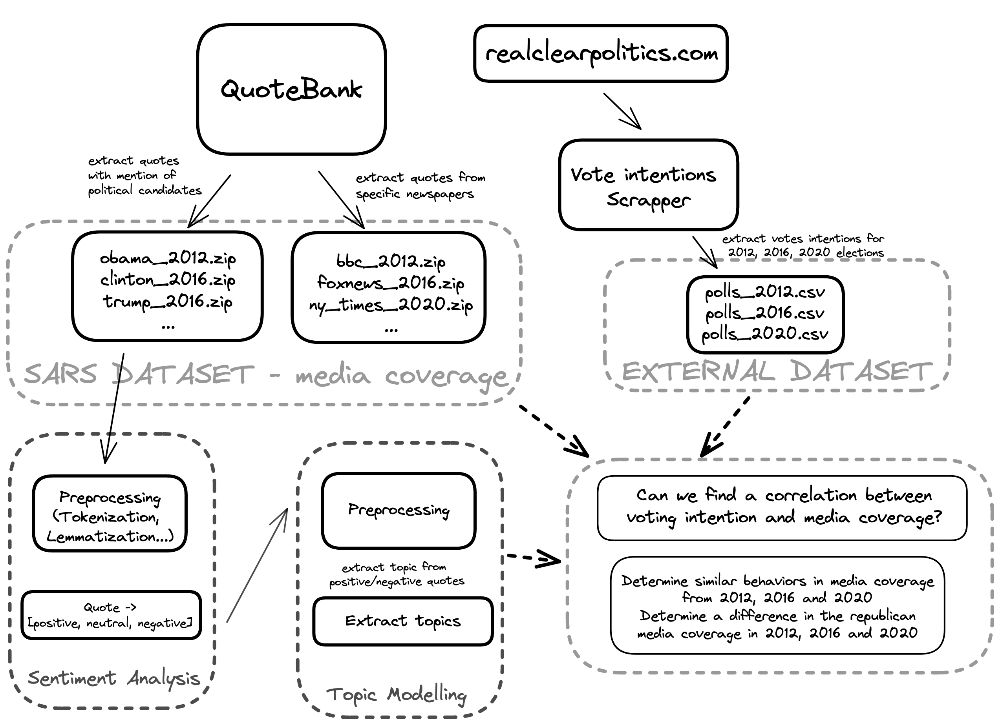
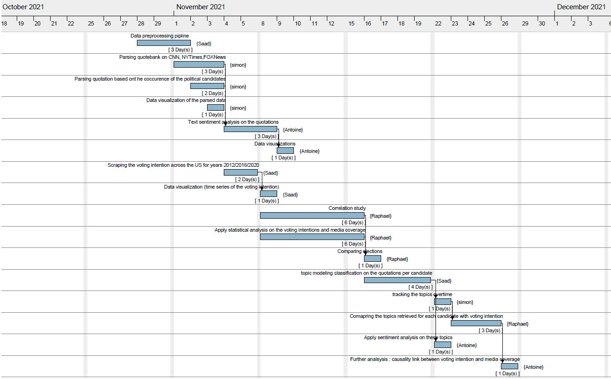

# Applied Data Analysis - Semester Project
EPFL Fall Semester 2021-2022
Raphael Bonatti, Simon Spangenberg, Antoine Crettenand, Saad Charkaoui

Presentation Link: click [here](https://simonspgn.github.io/ada_story/2021/12/11/ada-final.html)

## Abstract

It is often argued that former US president Donald Trump's upset victory in the 2016 elections significantly relates to his ability to monopolize the attention of mass media outlets [[1]](https://www.politico.com/magazine/story/2016/11/2016-election-trump-media-takeover-coverage-214419/). Although former president's polemical nature granted him a front row seat at almost every national newspaper in the months preceding the election [[2]](https://www.bbc.co.uk/news/36429660.amp), how can we precisely assess the influence that such incessant media coverage has had on the outcome of the elections? This it the question that we aim to answer in our study. We aim at using the quotebank corpus to analyse possible correlations and causations between the media coverage of three different major outlets with notoriously distinct political inclinations (CNN, BBC, NYTimes) and voting intentions in the months preceding each elections.

## Research Questions
* **Question 1**: How can we quantify media coverage? 
* **Question 2**: How can we quantify/parse voting intentions? 
* **Question 3.1** Can we find a correlation between voting intention and media coverage? Does the sentiment of the quotations have a stronger impact on the voting intention than the occurences of mentions (sentiment vs quantity)? 
* **Question 3.2**: Can we determine similar behaviors in media coverage from 2012, 2016 and 2020 (considering the different outcomes in the elections). Can we determine a difference in the republican media coverage (based on occurences and sentiment) in 2012, 2016 and 2020 (since the arrival and departure of Trump)? 
* **Further Optional Analysis**: Can we perform Topic Modeling on the quotations to determine whether in the labeled text sentiment analysis data, certain topics are reccurent and may have had an impact in the voting intentions?

## Methods

* **Part 1**: Quantifying Media Coverage ✔️ 
  * Method 1: We parse the Quotebank dataset based on the three newspapers we focus our study on(CNN, BBC, NYTimes). Once this parsing is done, we parse each quotation based on the occurence of the following keywords in the quotation, urls or speaker columns of the dataset. See [Notebook](media_coverage_occurences.ipynb):green_book: for detailed information.
  * Method 2: We perform text sentiment analysis on the quotations retrieved in the first method (on a presidential candidate basis) for each newspaper. See [Notebook](sentiment_analysis/unsupervised_sentiment_analysis.ipynb):blue_book: for detailed information.
  
* **Part 2**: Quantifying/Parsing voting intention data ✔️
  *  We scrape the website given in the Additional Analysis section. This website contains information relating to voting intentions taken from different surveys accross the United States from January 2012/2016/2020 to November 2012/2016/2020. See [Notebook](votes_intention.ipynb):orange_book: for detailed information.
* **Part 3.1**: Correlation Study ✔️
  * We use the Spearman Rank Coefficient test to determine whether there is correlation between voting intention and any of the two methods used to quantify media coverage of the three newspapers of interest. We find that some newspapers (specifically BBC) potentially exhibit a correlation between the media coverage and voting intentions. Further information concerning the data aggregation and analysis can be found under the following :closed_book:[Notebook](correlation_analysis/correlation_analysis.ipynb)
  * We expand the previous correlation study with generated sentiments in this :notebook:[Notebook](correlation_analysis/correlation_analysis_with_sentiment.ipynb).

* **Part 3.2**: Comparing the elections ✔️
  * Here too, we compare the distributions of media coverages and voting intentions accross the years. We aim at finding repeated patterns between the coverage of certain media and the voting intentions that can be observed accross each election. Additionally, we aim at finding whether the arrival of Trump in the 2016 elections has altered the way media have covered the elections (this may be done by comparing the media coverage between the 2012 and 2016 elections, we believe that text sentiment analysis may give us interesting results here). This is done by visually comparing the data processed in previous parts for each elections on a monthly/weekly basis. We can further expand our comparison analysis by performing null hypothesis tests and regression analysis.
* **Further Optional Analysis**: Topic Modeling ✔️
  * We develop a topic modeling analysis to cluster the quotations per candidate. We then compare the topics retrieved for each candidate with voting intentions for a specific month prior to the election. 

## Analysis Performed
We have noted in our analysis that the quotations for 2020 stops in April. As such, we decide to focus only on the months of January to April for the 2020 elections. Concerning 2016, we've noticed that some of the months contain very little quotations (most likely due to the unbalanced nature of the quotebank dataset). Here too, we decide to only conduct our study on the months for which we have enough data (i.e July, August, September). 
There are three notebooks: sentiment analysis, occurence analysis, scrapping polls. 
* :green_book:[media_coverage_occurences.ipynb](media_coverage_occurences.ipynb): includes parsing the data from quotebank dataset and quantitative study of candidate name occurence per newspaper. See notebook for detailed information.
* :open_file_folder:[sentiment_analysis](sentiment_analysis/) directory. Includes the following notebooks:
  * :blue_book:[unsupervised_sentiment_analysis.ipynb](sentiment_analysis/unsupervised_sentiment_analysis.ipynb): includes exploratory sentiment analysis with baseline implementation on the parsed [dataset](Data/). See notebook for detailed information. Additionnaly we provide another [notebook](sentiment_analysis/exploratory_data_analysis.ipynb) for exploratory data analysis of the data generated by the sentiment analysis.
* :orange_book:[votes_intention.ipynb](votes_intention.ipynb): includes the scraping of polls in 2012/20216/2020 (below the Additional Datsets), data cleaning and preprocessing, aggregating the polls by month to plot the timeseries per each candidate. See notebook for detailed information.
* :open_file_folder:[correlation_analysis](correlation_analysis/) directory. Includes the following notebooks:
  * :closed_book:[correlation_analysis.ipynb](correlation_analysis/correlation_analysis.ipynb): In this notebook we are interested in discovering if there is a relationship between the media coverage (by the newspapers) and the voting intention (for the elections of 2012, 2016 and 2020) and what kind relationship it is, in order to gain insights and form our conclusion. A baseline correlation study is performed. 
  * :notebook:[correlation_analysis_with_sentiment.ipynb](correlation_analysis/correlation_analysis_with_sentiment.ipynb): In this notebook we perform a similar correlation study as in the baseline model, except that we now include sentiment as a covariate of our analysis. 

## Additional Datasets
* :chart_with_upwards_trend:[Polls 2020 elections January-November](https://www.realclearpolitics.com/epolls/2020/president/us/general_election_trump_vs_biden-6247.html#polls)
* :chart_with_upwards_trend:[Polls 2016 elections January-November](https://www.realclearpolitics.com/epolls/2016/president/us/general_election_trump_vs_clinton-5491.html)
* :chart_with_upwards_trend:[Polls 2012 elections January-November](https://www.realclearpolitics.com/epolls/2012/president/us/general_election_romney_vs_obama-1171.html#!)

## Project overview

## Proposed Timeline & Team Organization
Below the Gantt diagram that illustrates the project schedule. This chart lists the tasks to be performed on the vertical axis, and time intervals on the horizontal axis. The width of the horizontal bars in the graph shows the duration of each Task.

## Additional Note
Original idea taking from the [following study](https://www.researchgate.net/publication/335908711_What_matters_context_or_sentiment_Analysing_the_influence_of_news_in_US_elections_using_Natural_Language_Processing). Our research aims to reproducing and expanding this study with the quotebank dataset. We believed that this research was ideal for ADA's semester project since it involves many of the topics covered in class: web scrapping/data retrieval, visualization, Unsupervised learning techniques (topic modeling and text sentiment analysis), correlation and causation study, etc.

## Work Repartition:
- Antoine: worked on the sentiment analysis (see sentiment analysis [folder](sentiment_analysis/)) and the correlation study involving sentiment analysis. 
- Raphael: worked on the baseline correlation study and aggregating the retrieved data. See correlation analysis [notebook](correlation_analysis.ipynb) and polls date parsing [notebook](polls_date_parsing.ipynb)
- Simon: worked on the media coverage parsing (see [notebook](media_coverage_occurences.ipynb)) and built the presentation website. 
- Saad: worked on the voting intentions scrapper (see [notebook](votes_intention.ipynb)) topic modeling and design of the website.
